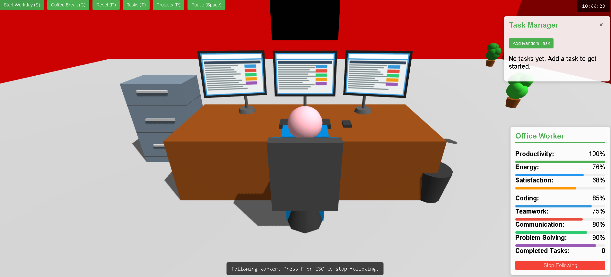

# Office Simulator Version 1  

A Three.js starting template for an office worker simulation, along with project and task management / LLM integration

Install instructions: 

*No installation required!* 

All modules are loaded inside the index.html file. Use an http server to see web page, i.e Python, http-server, live-server, etc
